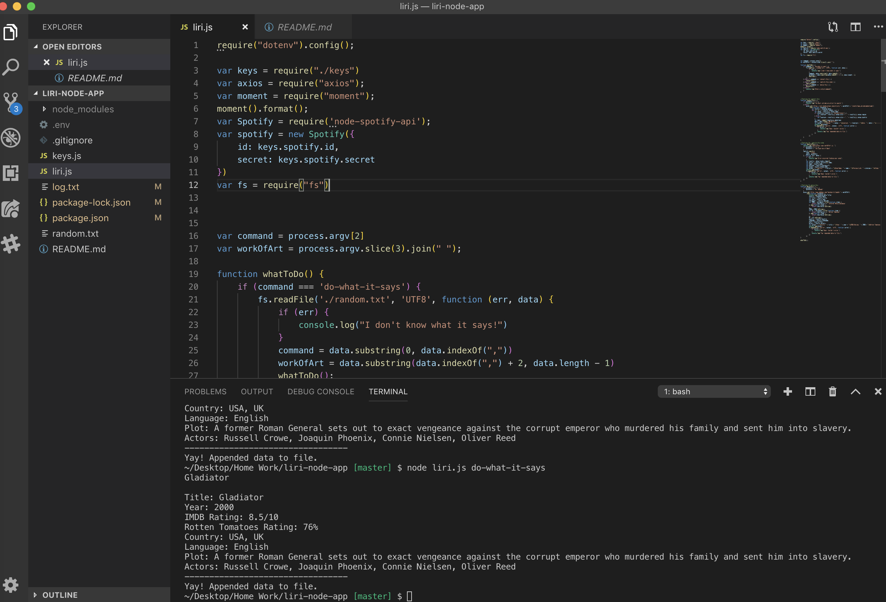
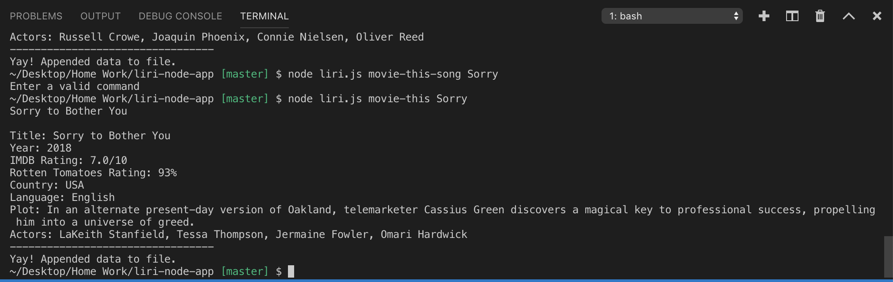

# liri-node-app

#### LIRI is A Node App via Command Line LIRI is like iPhone's SIRI. However, while SIRI is a Speech Interpretation and Recognition Interface, LIRI is a Language Interpretation and Recognition Interface. LIRI will be a command line node app that takes in parameters and gives you back data.

#### Use Liri to look up your favorite artist, song, or movie and get the information you need.

### Technologies Used
* Node.js
* JavaScript
* BansinTown API (via bandsintown npm module)
* Spotify API (via spotify npm module)
* OMDb API (via request npm module)

### Commands to run LIRI
* node liri.js concert-this < artist name here >
* node liri.js spotify-this-song < song name here>
* node liri.js movie-this < movie name here>
* node liri.js do-what-it-says

### API Credential sites
* Spotify: https://developer.spotify.com/my-applications/
* Bandsintown: https://rest.bandsintown.com/artists/
* OMDb API: http://www.omdbapi.com/apikey.aspx

### ScreenShots

